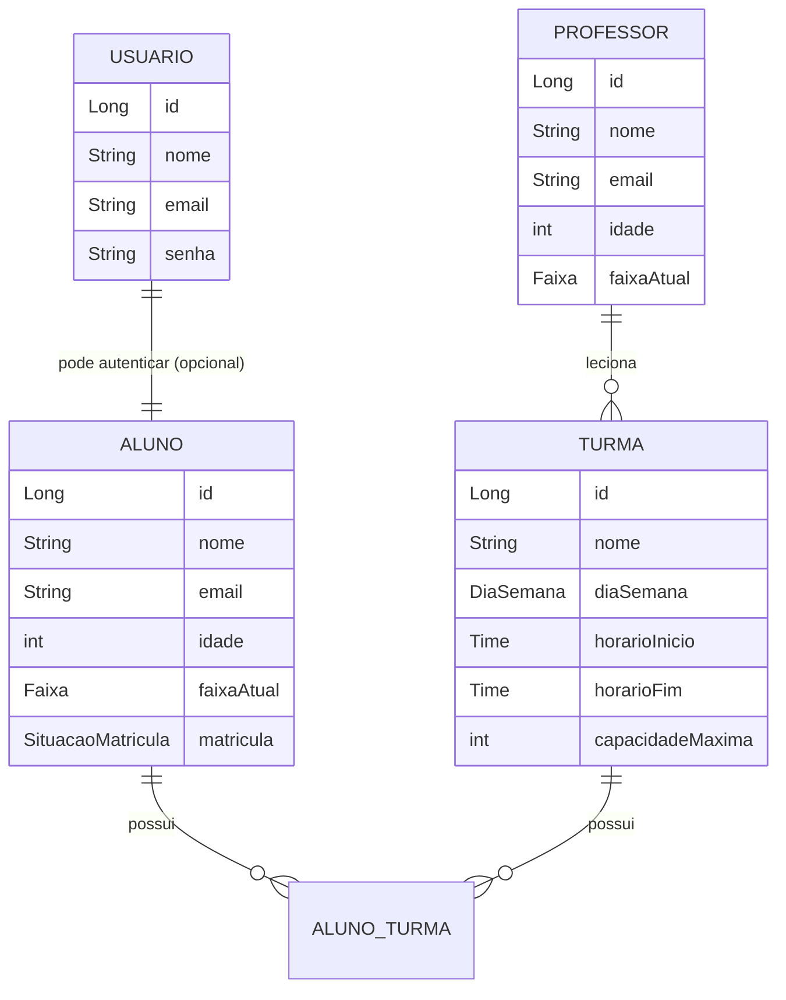

<div align="center">

# 🥋 JiujitsuAcademy API

**API RESTful para gestão completa de uma academia de Jiu-Jitsu** — alunos, professores, turmas e matrículas, com autenticação e autorização via JWT.

[](https://www.oracle.com/java/)
[](https://spring.io/projects/spring-boot)
[](https://www.postgresql.org/)
[](https://flywaydb.org/)
[](https://jwt.io/)
[](https://junit.org/junit5/)


[Sobre](#-sobre-o-projeto) •
[Funcionalidades](#-funcionalidades) •
[Arquitetura](#-arquitetura) •
[Modelagem](#-modelagem-de-dados) •
[Endpoints](#-endpoints-principais) •
[Como rodar](#-como-rodar-o-projeto) •
[Testes](#-testes)

</div>

---

## 📌 Sobre o projeto

O **JiujitsuAcademy** nasceu de um problema real de quem pratica Jiu-Jitsu: academias pequenas ainda controlam alunos, turmas e matrículas em planilha. Este projeto é o backend de um sistema de gestão que resolve isso — cadastro de alunos e professores, criação de turmas, matrículas e autenticação.

Foi construído como projeto de portfólio para consolidar, na prática, os pilares de uma API profissional em Java: **arquitetura em camadas, segurança stateless com JWT, versionamento de schema.

---

## ✨ Funcionalidades

- 👤 **Gestão de Alunos** — cadastro, atualização, consulta e remoção, com controle de faixa (Branca → Preta) e situação de matrícula (Ativa, Vencida, Encerrada)
- 🧑‍🏫 **Gestão de Professores** — CRUD completo, vinculação de professores às turmas
- 📅 **Gestão de Turmas** — criação com dia da semana, horário, capacidade máxima e professor responsável
- 📝 **Matrícula de alunos em turmas** — endpoint dedicado que associa aluno e turma, aplicando regras de negócio (bloqueio de matrícula duplicada)
- 🔐 **Autenticação e autorização com JWT** — registro e login de usuários, acesso a recursos protegidos por token
- 🛡️ **Controle de acesso por perfil** — respostas padronizadas 401 (não autenticado) e 403 (sem permissão) em todos os recursos protegidos
- ⚠️ **Tratamento centralizado de exceções**  retornando status HTTP semânticos (ex: 404 em recurso inexistente)
- 📄 **Documentação interativa** — todos os endpoints documentados via Swagger/OpenAPI

---

## 🏗️ Arquitetura

O projeto segue **arquitetura em camadas**, separando responsabilidades entre a exposição HTTP, as regras de negócio e a persistência:


```
┌─────────────────────────────────────────────────────────────────────┐
│                            CLIENTE                                  │
│                    Cliente / Swagger UI                             │
└───────────────────────────────┬─────────────────────────────────────┘
                                 │ HTTP + JWT
                                 ▼
┌─────────────────────────────────────────────────────────────────────┐
│                   CAMADA DE APRESENTAÇÃO                             │
│                                                                       │
│   ┌───────────────┐        ┌──────────────┐                         │
│   │  Filtro JWT   │───────▶│  Controller  │                         │
│   │  (Security)   │        │              │                         │
│   └───────────────┘        └──────┬───────┘                         │
└─────────────────────────────────────┼─────────────────────────────────┘
                                      │
                                      ▼
┌─────────────────────────────────────────────────────────────────────┐
│                     CAMADA DE NEGÓCIO                                │
│                                                                       │
│                    ┌──────────────┐                                 │
│                    │   Service    │                                 │
│                    └──────┬───────┘                                 │
│                           │                                         │
│                           ├───────────────▶ ┌──────────────────┐    │
│                           │                 │ Mapper           │    │
│                           │                 │ (Entity ⇄ DTO)   │    │
│                           │                 └──────────────────┘    │
└───────────────────────────┼──────────────────────────────────────────┘
                            │
                            ▼
┌─────────────────────────────────────────────────────────────────────┐
│                   CAMADA DE PERSISTÊNCIA                             │
│                                                                       │
│              ┌──────────────┐        ┌────────────────┐             │
│              │  Repository  │───────▶│  PostgreSQL    │             │
│              │              │        │     (DB)       │             │
│              └──────────────┘        └────────────────┘             │
└─────────────────────────────────────────────────────────────────────┘


        (fluxo de erro — em qualquer ponto do Controller)
┌─────────────────────────────────────────────────────────────────────┐
│                     TRATAMENTO DE ERROS                              │
│                                                                       │
│              ┌────────────────────────────┐                         │
│  Controller ─┊──▶  GlobalExceptionHandler  │                         │
│   (401/403/404/409)  └────────────────────┘                         │
└─────────────────────────────────────────────────────────────────────┘
```

## Resumo do percurso

1. **Cliente** envia requisição HTTP com token JWT
2. **Filtro JWT** valida o token antes de liberar o acesso
3. **Controller** recebe a requisição e delega ao **Service**
4. **Service** aplica as regras de negócio e usa o **Mapper** para converter entre `Entity` e `DTO`
5. **Service** chama o **Repository** para persistir/consultar dados
6. **Repository** acessa o **PostgreSQL**
7. Se algo falhar em qualquer etapa do Controller (ex: 401, 403, 404, 409), o erro é capturado por **Exceptions**


**Decisões de design:**

- **DTOs como Java Records**, separando o contrato de entrada/saída da entidade JPA — evita expor a estrutura interna do banco e simplifica validação de payload.
- **Mappers estáticos** (`AlunoMapper`, `ProfessorMapper`, `TurmaMapper`) em vez de bibliotecas como MapStruct — decisão consciente para manter controle explícito sobre a conversão Entity ⇄ DTO em um projeto desse porte.
- **`orElseThrow()` com exceções customizadas** em todos os pontos de busca por ID, garantindo respostas 404 consistentes sem `if/else` espalhado pelo código.
- **Relacionamento `@ManyToMany`** entre `Aluno` e `Turma` (em vez de uma entidade `Matricula` separada), já que a matrícula em si não carrega atributos próprios além da associação.


---

## 🗃️ Modelagem de dados




---

## 🔌 Endpoints principais

### Autenticação

| Método | Endpoint | Descrição | Autenticação |
|---|---|---|---|
| `POST` | `/auth/register` | Cadastra um novo usuário | Não |
| `POST` | `/auth/login` | Autentica e retorna token JWT | Não |

### Alunos

| Método | Endpoint | Descrição |
|---|---|---|
| `GET` | `/aluno` | Lista todos os alunos |
| `GET` | `/aluno/{id}` | Busca aluno por ID |
| `POST` | `/aluno/save` | Cadastra novo aluno |
| `PUT` | `/aluno/update/{id}` | Atualiza aluno existente |
| `DELETE` | `/aluno/delete/{id}` | Remove aluno |

### Professores

| Método | Endpoint | Descrição |
|---|---|---|
| `GET` | `/professor` | Lista todos os professores |
| `GET` | `/professor/{id}` | Busca professor por ID |
| `POST` | `/professor/save` | Cadastra novo professor |
| `PUT` | `/professor/update/{id}` | Atualiza professor existente |
| `DELETE` | `/professor/delete/{id}` | Remove professor |

### Turmas

| Método | Endpoint | Descrição |
|---|---|---|
| `GET` | `/turma` | Lista todas as turmas |
| `GET` | `/turma/{id}` | Busca turma por ID |
| `POST` | `/turma/save` | Cadastra nova turma vinculada a um professor |
| `PUT` | `/turma/update/{id}` | Atualiza turma existente |
| `DELETE` | `/turma/delete/{id}` | Remove turma |
| `POST` | `/turma/{turmaId}/matricular/{alunoId}` | Matricula um aluno na turma |

Todos os endpoints (exceto `/auth/*`) exigem token JWT no header:
```
Authorization: Bearer {seu_token}
```

📖 Documentação interativa completa disponível em `/swagger-ui/index.html` com o projeto em execução.

---

## ⚙️ Regras de negócio destacadas


- **Recursos não encontrados** → busca por ID inexistente (aluno, professor ou turma) retorna `404`, tratado de forma centralizada via `GlobalExceptionHandler` em vez de verificação manual em cada controller.
- **Autorização por perfil** → endpoints de escrita (`save`, `update`, `delete`) retornam `403` para usuários autenticados sem permissão, e `401` para requisições sem token válido.

---

## 🔐 Segurança

A API utiliza **Spring Security** com autenticação **stateless via JWT**:

1. O usuário se registra (`/auth/register`) e faz login (`/auth/login`).
2. O login retorna um token JWT assinado, com tempo de expiração definido.
3. O token deve ser enviado no header `Authorization: Bearer {token}` em todas as requisições a endpoints protegidos.
4. Um filtro (`OncePerRequestFilter`) intercepta cada requisição, valida o token e popula o contexto de segurança do Spring — sem necessidade de sessão no servidor.

---

## 🧪 Testes

A camada de serviço (`AlunoService`, `ProfessorService`, `TurmaService`) possui suíte de testes unitários com **JUnit 5** e **Mockito**, cobrindo:

- ✅ Fluxos de sucesso (cadastro, atualização, busca e remoção)
- ✅ Cenários de exceção (recurso não encontrado, dados inválidos)
- ✅ Validações de negócio complexas (ex: matrícula duplicada, vínculo com professor inexistente)

```bash
# Rodar todos os testes
mvn test
```


---

## 🚀 Como rodar o projeto

### Pré-requisitos

- Java 21+
- Maven 3.9+
- Docker e Docker Compose

### Passo a passo

```bash
# 1. Clone o repositório
git clone https://github.com/KayoSouzas/JiujitsuAcademy.git
cd JiujitsuAcademy

# 2. Suba o banco de dados PostgreSQL via Docker
docker compose up -d

# 3. As migrations do Flyway rodam automaticamente na subida da aplicação

# 4. Execute a aplicação
mvn spring-boot:run
```

A API estará disponível em `http://localhost:8080` e a documentação Swagger em `http://localhost:8080/swagger-ui/index.html`.

### Variáveis de ambiente

| Variável | Descrição | Exemplo |
|---|---|---|
| `DB_URL` | URL de conexão com o PostgreSQL | `jdbc:postgresql://localhost:5432/jiujitsuacademy` |
| `DB_USERNAME` | Usuário do banco | `postgres` |
| `DB_PASSWORD` | Senha do banco | `postgres` |
| `JWT_SECRET` | Chave usada para assinar os tokens JWT | `8f3a9c2e1b7d4f6a0e5c8b1d3f7a9e2c4b6d8f0a1c3e5b7d9f1a3c5e7b9d1f3a` |
| `JWT_EXPIRATION` | Tempo de expiração do token (ms) | `3600000` |

---

## 🗺️ Roadmap

- [ ] Paginação nas listagens (`GET /aluno`, `GET /turma`, `GET /professor`)
- [ ] Validação de capacidade máxima na matrícula
- [ ] Testes de integração


---

<div align="center">

## 👤 Autor

**Kayo de Souza**
| Desenvolvedor Java Backend

[GitHub](https://github.com/KayoSouzas) • [LinkedIn](https://www.linkedin.com/in/kayo-souza-20808936a/)

</div>
